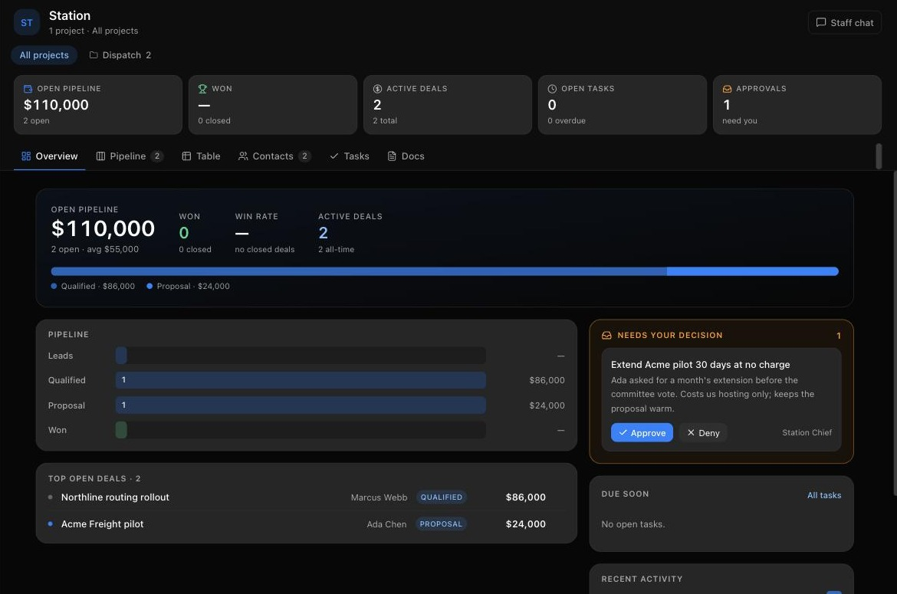
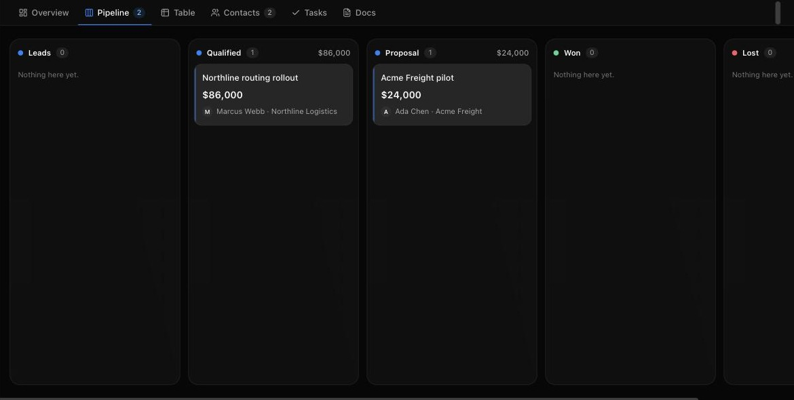

# Hands

**Staff with their own computer and your logins, working while you're doing something else.**

It uses the AI you already pay for, and everything it does stays on your machine.

[**Download**](https://github.com/jackofshadowz/handscrm-releases/releases/latest) · [tryhands.com](https://tryhands.com) · [What a Hand does](https://tryhands.com/features) · [Pricing](https://tryhands.com/pricing) · [Questions](https://tryhands.com/faq)

---

## Hire one in ten seconds, fire it in one

A Hand has a name, a face, a model, a computer, and a job. You build the staff you need — a chief of
staff who runs the roster, a specialist per project, someone who only watches the inbox. Each one
keeps its own memory of its own work.

There is no catalogue of industries and no library of automations to shop from. A Hand doing an
agency's proposals and a Hand watching a property portfolio are the same object with different
briefs and different accounts attached.

*One company's board: what's open, what it's worth, what needs you today.*

## What one does

- **Works on a real computer.** An isolated Linux desktop in the cloud, a local VM, or this machine
  after an explicit opt-in. You can watch the screen while it works and take over at any point.
- **Uses your accounts.** Gmail, Slack, GitHub, Notion, Linear and hundreds more connect once, per
  company. A Hand in one company can never reach another company's accounts.
- **Asks before the irreversible thing.** Spending, sending, an ambiguous call — each arrives as a
  card: allow, deny, or answer the question in a sentence.
- **Writes down what it did.** Every action lands as an entry with a time and a name on it. Ask what
  happened this week and the answer is the record.
- **Remembers.** Long threads fold into summaries instead of falling off the end of a context
  window, so the next Hand you hire starts knowing the account.

*The same rows a Hand writes to are the rows you're looking at.*

## Download

> **Early access.** Builds go out to a small group at a time, so the releases page below may be
> empty when you get here. [Leave an address](https://tryhands.com/#waitlist) and you get one email
> when yours is ready — nothing else.

Builds land on the [releases page](https://github.com/jackofshadowz/handscrm-releases/releases/latest).
The app updates itself from here afterwards.

| Platform | File |
| --- | --- |
| macOS, Apple silicon | `Hands-<version>-arm64.dmg` |
| macOS, Intel | `Hands-<version>-x64.dmg` |
| Windows | `Hands-<version>-setup.exe` |
| Linux | `Hands-<version>.AppImage` or the `.deb` |

macOS builds are signed and notarized. If Gatekeeper still objects, you have the wrong file for your
chip — check arm64 against Intel.

## On your machine

Hands runs on your own computer. Your files, your history and everything your staff have done stay
in one folder that belongs to you. There is no account to create, and you can copy the whole thing to
a backup drive.

What does leave: the model requests themselves, to whichever provider you have configured — bring
your own Claude, Codex or Grok subscription and it goes straight to them. Connected accounts
authenticate through a broker that holds the OAuth handshake and never the contents of your work.
The long version is in the [questions](https://tryhands.com/faq).

Found a security problem? [SECURITY.md](SECURITY.md) — please don't open a public issue for it.

## What this repository is

The **releases and the issue tracker**, and nothing else. Downloads live here, the app's updater
points here, and this is where to report a bug or ask for something.

The application source is not here. Hands is built on
[OpenMausBot](https://github.com/milind-soni/OpenMausBot), which is licensed under Apache-2.0, and
that code is public at the upstream project — the runtime you install is that code plus our own work
on top. The [team catalogue](https://github.com/jackofshadowz/hands-teams) your Hands read from is
public too. [`NOTICE`](NOTICE) records what is inherited and what is ours.

## Getting help

- Something broken → [open an issue](https://github.com/jackofshadowz/handscrm-releases/issues/new/choose)
- Everything else → [hello@tryhands.com](mailto:hello@tryhands.com), and a person reads it

---

Apache-2.0 · © 2026 General Intelligence Systems

